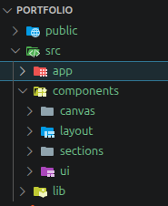

# 🚀 Developer Portfolio

A modern, responsive, and highly animated developer portfolio built with **Next.js**, **Tailwind CSS**, **Framer Motion**, and **Three.js**.  
It showcases projects, skills, and experience with a focus on smooth UI/UX, performance, and modern frontend design principles.

---

## ✨ Features

- ⚡ Modern responsive UI with dark theme
- 🎬 Smooth animations using Framer Motion
- 🧊 3D interactive elements using Three.js / React Three Fiber
- 📂 Dynamic GitHub integration (fetches latest repositories)
- 🧠 Structured sections: Hero, About, Skills, Projects, Contact
- 📩 Contact form integration (Formspree / EmailJS)
- 🎨 Glassmorphism + gradient-based design system
- 📱 Fully mobile responsive
- 🚀 Optimized for performance and SEO

---

## 🛠️ Tech Stack

- **Framework:** Next.js (React)
- **Styling:** Tailwind CSS
- **Animations:** Framer Motion
- **3D Graphics:** Three.js / React Three Fiber
- **API:** GitHub REST API
- **Forms:** Formspree / EmailJS
- **Icons:** Lucide React

---

## 📁 Project Structure



---

## 🚀 Getting Started

### 1. Clone the repository
```bash
git clone https://https://github.com/arham61/Portfolio.git
cd Portfolio

2. Install dependencies 
npm install
# or
pnpm install

3. Run development server
npm run dev

Open http://localhost:3000 to view it in your browser.

🔑 Environment Variables

Create a .env.local file in the root:
GITHUB_TOKEN=your_github_token
GITHUB_USERNAME=your_username
FORM_ENDPOINT=your_formspree_or_emailjs_endpoint

📸 Preview

Add screenshots or a demo GIF here once deployed

🌐 Live Demo

👉 https://portfolio-omega-ten-gcw3xlli7x.vercel.app/

📌 Features in Detail
🎯 GitHub Integration

Automatically fetches and displays the latest 3 repositories with:

-Repository name
-Description
-Tech stack
-Stars count
-Live & GitHub links


🎨 Animations
-Scroll-based animations
-Hover effects
-Page transitions
-3D interactive elements


📬 Contact System
-Secure form validation
-Anti-spam protection (recommended: Turnstile/CAPTCHA)
-Email delivery via Formspree or EmailJS


📈 Future Improvements
-Blog integration
-Admin dashboard
-CMS support (Sanity / Strapi)
-More advanced 3D scenes
-Performance optimizations (lazy loading assets)

🧑‍💻 Author

Arham Hussain

GitHub: https://github.com/arham61
LinkedIn: https://www.linkedin.com/in/arham-hussain-5b4a92296
Portfolio: https://portfolio-omega-ten-gcw3xlli7x.vercel.app/
📄 License

This project is open source and available under the MIT License.